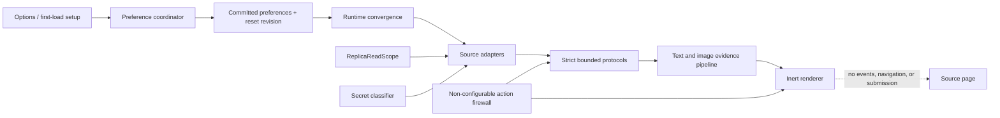

# Architecture Spine — Translated replica read-scope redesign

## Design Paradigm

The replica is a policy-enforced evidence pipeline inside a deny-by-construction capability shell. Source adapters may observe only evidence admitted by one immutable `ReplicaReadScope`; sanitizers convert that evidence into bounded, strictly parsed protocols; translators and image readers transform it; inert renderers display it. A separate action firewall owns the iframe sandbox, CSP, active-attribute stripping, event suppression, and absence of source-event forwarding. Read policy may change at runtime; action capability may not.

This spine supersedes only the earlier blanket exclusion of every private/value-bearing region in the passive-replica specification. Its credential-secret exclusion and action-inertness requirements remain binding. The canonical specification and project context must be reconciled to that narrower change before implementation begins.



Dependencies point from entrypoints toward policy and protocol libraries. Source adapters, OCR providers, and renderers may depend on policy contracts; policy code must not depend on browser entrypoints or provider implementations. The read scope cannot be consulted by or alter the action firewall.

## Invariants & Rules

### AD-1 — Replica action capability is permanently absent [ADOPTED]

- **Binds:** ACT-1, CTRL-1, all replica modes and read profiles
- **Prevents:** A fidelity or privacy setting accidentally enabling page actions, source event forwarding, navigation, form submission, downloads, or script execution.
- **Rule:** Every replica remains inside the existing scriptless, workerless, form-disabled, navigation-disabled sandbox and CSP; source active attributes and handlers are stripped; website-originated pointer and keyboard actions are suppressed; no protocol can carry an input event back to the source. Only explicitly marked extension-owned read-only controls may receive events, and their handlers may mutate replica-owned presentation state only.

### AD-2 — Read admission is a source-side, fail-closed policy decision

- **Binds:** READ-1, READ-2, IMG-1, CTRL-1
- **Prevents:** Sensitive data being read and then discarded later, ARIA roles being mistaken for privacy boundaries, and adapters inventing incompatible notions of private content.
- **Rule:** One browser-independent `ReplicaReadScope` and one shared secret classifier decide eligibility before code accesses a current value, editable text, accessibility string, or image pixels. Role semantics, actionability, and secrecy are independent classifications. Missing, unknown, or malformed scope input—including malformed data carrying the current schema version—repairs to Page-only; unknown source classifications are withheld. Protocol parsers accept exact keys and bounded values only.

### AD-3 — Independent capabilities are canonical; profiles are derived presets

- **Binds:** READ-1, LIVE-1
- **Prevents:** A single coarse privacy switch, contradictory profile/toggle state, and settings that apply only at startup.
- **Rule:** Persist the six independent capabilities in this exact order: `controlSemantics`, `controlImages`, `disclosureContent`, `formValues`, `personalDataValues`, and `editableContent`. Preset matrices are `Page only = false,false,false,false,false,false`, `Standard = true,true,true,false,false,false`, and `Full visible = true,true,true,true,true,true`. Presets are atomic pure functions over those booleans; any manual edit derives `Custom` and no profile enum is an independent source of truth. `controlImages` gates only images inside non-secret controls; ordinary page images remain governed by the image-translation feature and method list. The same controls appear during first-load setup and in live Options.

### AD-4 — Credential secrets are outside every configurable scope

- **Binds:** READ-2, IMG-1, all profiles
- **Prevents:** Passwords, authentication material, payment secrets, tokens, or local file paths entering a message, cache, diagnostic, or replica.
- **Rule:** Classify before reading and always exclude native password fields; hidden inputs; file inputs and paths; autocomplete `current-password`, `new-password`, `one-time-code`, every `cc-*` class, and `webauthn`; and computed CSS text-security fields whose normalized value is not `none`. Images overlapping an excluded region are blocked. Credential classification is sticky for each node during the document lifetime: later mutation to an ordinary type or removal of an autocomplete hint cannot re-admit it. The classifier may inspect tag, normalized type/autocomplete/role, ancestry, and computed text-security before any content accessor; it must not inspect value, text, alt, or label content to decide admission. Unsupported value-bearing controls are withheld. A credential facsimile may show a fixed redaction independent of whether a source value exists; it must not reveal length.

### AD-5 — Broader visible-value categories remain separately selectable

- **Binds:** READ-1
- **Prevents:** Treating all user-entered text as either harmless or secret and denying users meaningful control.
- **Rule:** Classify every candidate exhaustively as `secret`, `personal`, `ordinary-form`, `editable`, `public-semantic`, or `withheld`. `ordinary-form` is limited to native `textarea` and `input` with missing/`text`/`search`/`url` type and no personal/secret autocomplete token. `personal` is limited to native `email`/`tel` or exact autocomplete tokens for name/username/email/organization/address/country/postal/birthday/sex/telephone families; the exported classifier constant enumerates every accepted token and excludes all `cc-*`. `editable` is limited to explicit contenteditable other than `false` and non-native elements with exact role `textbox` or `searchbox`; other value-bearing controls are `withheld`. `formValues` admits `ordinary-form`; `personalDataValues` admits `personal` only when `formValues` is also true; `editableContent` admits `editable`. `disclosureContent` admits at most 1,024 nodes/256 KiB only when a unique same-document target is named by one visible controller's `aria-controls`, the controller carries boolean `aria-expanded`, the target is hidden only as that collapsed presentation, and neither side intersects secret or form-value content. Placeholder and attribute-backed label handling belongs to `public-semantic`. Selected option labels and checked/selected state are current form data and require `formValues`; expanded state requires `disclosureContent`. No raw field names, form actions, submission metadata, or DOM values unrelated to visual output are transported.

### AD-6 — Runtime policy changes are epoch transitions, not mutable filters

- **Binds:** LIVE-1, READ-1, IMG-1
- **Prevents:** Stale broad-scope content surviving a privacy tightening, partially reconfigured engines, and an optimistic UI update masking the committed storage event.
- **Rule:** Maintain committed preferences separately from UI drafts. Narrowing begins a two-phase epoch transition: broadcast close-gate/purge to connected panels, await acknowledgements or revoke their leases, then persist; if persistence fails, all participants remain at the safe intersection of old and proposed scopes until a later successful commit. Broadening starts only after a successful coordinator commit. Every committed read-scope or image-method change aborts capture, translation, OCR, semantic channels, and source leases; invalidates document and policy generations; clears content-bearing memory; and recaptures through both replica and image paths with one immutable policy fingerprint. A late result from an older fingerprint is rejected.

### AD-7 — Accessibility image text is semantic evidence, never simulated OCR

- **Binds:** IMG-1
- **Prevents:** Fake OCR confidence, unnecessary screenshot permission, inaccessible alt-only images, and inconsistent source/replica metadata.
- **Rule:** Define `ImageReadingMethodId = 'accessibility-text' | ImageTextProviderId` and persist one complete, reorderable method list plus disabled IDs. Keep `accessibility-text` out of the offscreen OCR registry and place it first by default. Storage migration prepends it to the repaired existing provider order without changing provider-relative order, but it remains runtime-disabled until the current read-scope setup version is committed. Its source request lazily reads only direct image-owned `aria-label` then `alt`, plus the nearest valid language tag; normalizes Unicode whitespace; caps text at 3,500 characters; and rejects decorative, hidden, URL/filename-only, and no-letter/no-number candidates. Ordinary non-control images are eligible when image translation is enabled; direct evidence inside non-secret navigation/disclosure controls additionally requires `controlImages`. It returns explicit semantic provenance without confidence. Missing, blocked, stale, untranslated, or empty evidence falls through to the next method; duplicate visible labels are resolved at projection time, never by suppressing source evidence.

### AD-8 — The image planner delays pixels until an OCR method needs them

- **Binds:** IMG-1, READ-1
- **Prevents:** Alt-only use requiring broad host access, a failed OCR host blocking later semantic evidence, and small icon labels being skipped by OCR geometry policy.
- **Rule:** Walk the unified method order lazily. Read semantic evidence only when its position is reached; acquire pixels only on reaching the first enabled OCR method; group contiguous OCR methods while preserving their exact order, hints, corroboration, confidence filtering, retries, and cache behavior. No provider-specific empty result may skip a later method, and a group-level host failure returns to the planner so later semantic or OCR groups may run. `skipSmallImages` gates small OCR captures only; positive-area accessibility text remains eligible, while zero-area and tracking-pixel exclusions remain. Optional pixel-capture permission is required only when an enabled route reaches pixel OCR.

### AD-9 — Image evidence has provenance-neutral projection geometry

- **Binds:** IMG-1
- **Prevents:** Forcing semantic labels through OCR box/bitmap contracts and overlaying stale or unsafe markup.
- **Rule:** Normalize accepted image evidence into image-relative regions with explicit `methodId`, `evidenceKind`, and placement. OCR boxes normalize through captured crop geometry. Accessibility text projects as one clipped, centered, inset translucent label over the image rather than whitening the bitmap. Rendering assigns translated strings through `textContent`, is pointer-inert, and keys freshness to document, node, content revision, method configuration, language pair, and evidence identity. Diagnostics carry method/status/counts only, never source or translated text.

### AD-10 — Image descriptors stay content-free; evidence reads are explicit

- **Binds:** IMG-1, READ-2
- **Prevents:** Broadcasting accessibility text to observers that did not request it and losing mutation/staleness guarantees.
- **Rule:** Keep scheduling descriptors free of URL, text, pixels, and hashes. Extend the exact-document image-source protocol with a strict evidence-read request and `ready | none | blocked | stale` response. Observe `alt`, `aria-label`, `aria-hidden`, and `role` mutations as content revisions so in-flight work is cancelled. Apply the hard-secret floor during discovery and the selected `controlImages` admission gate at evidence/pixel read time. Both rrweb and isolated-HTML bridges use this one source-image session contract.

### AD-11 — Both replica engines share one semantic supplement channel

- **Binds:** READ-1, LIVE-1, CTRL-1
- **Prevents:** rrweb or Integrated exposing more than selected, silently showing less, or weakening recorder masking to gain fidelity.
- **Rule:** Keep rrweb `maskAllInputs: true` and contenteditable masking permanently enabled. Base rrweb and Integrated streams must omit every optional current value/state/disclosure payload and every optional attribute-backed control/image label (`aria-label`, eligible `alt`, placeholder, state attributes); ordinary already-visible text nodes remain public page content. Move semantic records through one separate typed, bounded, exact-document channel used by both engines, and inject translated attributes/facsimile state only after admission. Source-side classification is authoritative and happens before content access. Each record carries bridge ID (`rrweb` or `isolated-html`), an ID from that bridge's node namespace, allowlisted category, canonical normalized tag/type/autocomplete/role classes, classifier version, and document/node/revision/policy identity; source-only style evidence and sticky history never cross. The receiver resolves the node through the named bridge and structurally validates the proof. The channel permits at most 3,500 UTF-16 code units per content field, 128 records and 256 KiB per batch, four unacknowledged batches, and 50,000 live node identities; overflow closes the channel and requires a fresh bounded checkpoint. Public image accessibility evidence and control-image admission continue only through the shared image-source channel.

### AD-12 — Control semantics are readable metadata, not action authority

- **Binds:** CTRL-1, READ-1, IMG-1
- **Prevents:** `aria-controls`, `aria-expanded`, or `aria-haspopup` suppressing legitimate navigation images; inaccessible replacement controls; and source handlers leaking into the mirror.
- **Rule:** When `controlSemantics` is enabled, transport bounded public labels and non-user-derived disabled semantics. Checked/selected values require `formValues`; expanded state and its content require `disclosureContent`. ARIA relationship attributes are remapped only to validated sanitized replica-owned IDs; they do not disqualify an image or grant behavior. Render native selects and source disclosure/menu controls as extension-owned inert facsimiles with renderer-owned roles and state. Never preserve an active source handler, form association, target, or navigation behavior.

### AD-13 — Extension-owned disclosures share one viewport-safe presenter

- **Binds:** CTRL-1
- **Prevents:** Select options or disclosure menus being clipped by source overflow, detached during scroll, or controlled by inconsistent code paths.
- **Rule:** One replica disclosure presenter owns select lists and sanitized disclosure/menu expansions. It portals the presented list into replica-owned top-layer content, positions it against the trigger, constrains height to the replica viewport, updates on scroll/resize, and closes on Escape/outside activation. It may change replica-owned ARIA state and focus only. All option/list content is non-actionable and pointer interaction never reaches the source.

### AD-14 — Preferences and reset have one serialized owner

- **Binds:** LIVE-1, RESET-1
- **Prevents:** Multi-window lost updates, pre-reset commands resurrecting settings, permission state disagreeing with preferences, and partial reset leaving active reading enabled.
- **Rule:** The background `PreferenceCoordinator`, under the existing global lock, is the only durable settings writer. Persist `readScopeSetupVersion`, monotonically increasing `resetRevision`, and a resumable `resetCleanupPendingRevision`. Every mutating command carries the caller's expected reset revision; setup completion also carries expected setup version. Stale commands are rejected. Missing or outdated setup has an effective Page-only scope until a full setup commit succeeds. Storage change and command responses converge through one committed-preference application path in every panel.

### AD-15 — Reset becomes safe before cleanup becomes complete

- **Binds:** RESET-1, LIVE-1
- **Prevents:** A failed permission or cache cleanup leaving features active, broad orphaned origin grants, and reset erasing unrelated future storage.
- **Rule:** After an accessible in-panel confirmation, atomically persist canonical feature-off defaults with incremented `resetRevision`, setup version zero, and that revision marked cleanup-pending; only then reconcile actual optional host origins. Never call `storage.local.clear`. Cleanup removes origins not desired by the latest committed revision, so a valid post-reset setup/grant is preserved; an old in-flight grant with a stale revision is revoked. Open panels immediately abort all work, release replicas/source sessions, clear translation and OCR memories, diagnostics, composer content, and detected language state; clear the transient OCR object store; and close the OCR offscreen document. Background startup resumes pending cleanup and clears its marker only after verified reconciliation. Cleanup failures return allowlisted counts/status only and remain retryable; a settings-write failure leaves permissions untouched.

### AD-16 — First-load setup never grants permission implicitly

- **Binds:** READ-1, IMG-1, RESET-1
- **Prevents:** Upgrade defaults silently broadening reads or host access and setup becoming the only place users can change privacy.
- **Rule:** Missing or outdated setup version enforces Page-only while showing the reusable readable-content chooser with Standard selected as an uncommitted suggestion and clear disclosure that actions are always disabled while non-secret visible data may be personal. Completing setup commits the full scope atomically. Permission requests remain separate explicit gestures. The same independent controls stay editable in Options while running. Reset returns setup to this state without deleting packaged assets or Chrome-managed translation models.

### AD-17 — Source-derived content is memory-only

- **Binds:** READ-1, READ-2, IMG-1, RESET-1
- **Prevents:** Read-scope expansion becoming durable data collection.
- **Rule:** Persist settings only. Source values, accessibility text, OCR transcripts, translations, pixels, and replica DOM remain bounded in memory except the existing short-lived transient pixel handoff, which is removed in `finally`, expires, and is cleared on reset. Logs and diagnostics are content-free. No remote executable code, analytics payload, or new network service is introduced.

## Consistency Conventions

| Concern | Convention |
| --- | --- |
| Naming | `ReplicaReadScope` names source-reading capability; `ImageReadingMethodId` names semantic and OCR methods; `ImageTextProviderId` remains OCR-runtime-only; renderer-owned controls and attributes use the `simul` / `data-simul-*` namespace. |
| Policy data | Canonical boolean objects are frozen, strictly parsed at command boundaries, safely repaired at storage boundaries, and fingerprinted with an explicit schema/setup version. Profiles are pure functions over those objects. |
| Secret classification | Classifier functions receive source-local DOM facts and return a category before any value/evidence accessor runs. Call sites test category plus selected scope; they never duplicate tag/role/autocomplete lists. |
| Protocols | Bridge ID and bridge-scoped node identity, exact-document identity, policy fingerprint, classifier version, positive bounded revisions, exact keys, bounded strings/arrays/batches, and discriminated status envelopes. Unknown fields or stale generations fail closed. |
| Runtime mutation | Background-coordinated commit first; one convergence function applies committed state. Tightening purges before save, broadening waits for save, and every generation-bound result verifies currency before display. |
| Errors and diagnostics | Stable allowlisted codes, counts, dimensions, method/provider IDs, and stages only. Never URLs, origins, node IDs, source strings, translated strings, hashes, or classifier inputs. |
| Rendering | Assign user/source-derived strings with `textContent` or validated attributes; overlays and source facsimiles are inert. Only extension-owned presenters attach listeners. |
| Testing | Every configurable admission path pairs an allow test with hard-secret denial and stale-result rejection; every replica control test also asserts no source event, navigation, or submission. |

## Stack

| Name | Version |
| --- | --- |
| Node.js | 24 LTS (`>=24 <25`) |
| npm | `>=12 <13` |
| Chrome extension platform | Manifest V3 |
| WXT | 0.20.27 |
| TypeScript | 7.0.2 |
| Vitest | 4.1.10 |
| rrweb record / replay | 2.1.0 |
| Tesseract.js / core | 7.0.0 |
| tesseract-wasm | 0.11.0 |
| PaddleOCR.js | 0.4.2 |
| ONNX Runtime Web | 1.24.3 |

## Structural Seed

```text
lib/
  preferences.ts                         # persisted scope, methods, setup/reset revisions
  preference-coordinator.ts              # serialized commits, permission reconciliation, reset
  replica/
    read-scope-policy.ts                  # profiles, parsing, fingerprint, adapter capability
    source-secret-classifier.ts           # hard secret and personal-data classification
    source-privacy-policy.ts              # source accessors gated by the shared classifiers
    semantic-source-protocol.ts           # engine-neutral typed control/editor supplements
    semantic-source-session.ts            # policy-bound source reads and sticky classification
    html-mirror-source.ts                 # policy-bound Integrated source adapter
    live-recorder-session.ts              # conservatively masked rrweb adapter
    html-mirror-sanitizer.ts              # passive transport; no policy invention
    isolated-html-engine.ts               # inert controls and common disclosure presenter
  ocr/
    image-reading-methods.ts              # semantic + OCR ordering and disabled methods
    image-source-protocol.ts              # content-free discovery and explicit evidence read
    image-source-session.ts               # shared rrweb/Integrated source implementation
    image-translation-controller.ts       # lazy ordered reading planner
    image-analysis-coordinator.ts         # OCR-only provider group execution and confidence
    image-overlay-projector.ts            # provenance-neutral relative projection
entrypoints/
  background.ts                           # reset/setup/preference command boundary
  sidepanel/
    main.ts                               # committed-state convergence and runtime purge
    style.css                             # setup, readable-content, method, reset UI
tests/                                    # policy, protocol, runtime, security, and UI contracts
```

```mermaid
stateDiagram-v2
  [*] --> SetupRequired: setup version missing/outdated
  SetupRequired --> Committed: atomic profile/custom commit
  Committed --> Narrowing: user disables a read capability
  Narrowing --> Purged: close gate + discard broad content
  Purged --> Committed: coordinator commit + recapture
  Committed --> Broadening: user enables a read capability
  Broadening --> Committed: successful commit + recapture
  Broadening --> Committed: failed/stale commit; remain narrow
  Committed --> Resetting: confirmed reset
  Resetting --> SetupRequired: defaults committed; async cleanup
```



## Capability → Architecture Map

| Capability / Area | Lives in | Governed by |
| --- | --- | --- |
| READ-1 selectable readable-content policy | `preferences`, `replica/read-scope-policy`, Options/setup UI | AD-2, AD-3, AD-5, AD-6, AD-14, AD-16 |
| READ-2 credential-secret floor | `replica/source-secret-classifier`, source adapters, image admission | AD-2, AD-4, AD-17 |
| IMG-1 accessibility image text method | image source protocol/session, reading planner, projector, method UI | AD-7 through AD-10, AD-17 |
| CTRL-1 inert control/disclosure mapping | sanitizer, isolated engine, disclosure presenter | AD-1, AD-12, AD-13 |
| LIVE-1 runtime policy convergence | coordinator, background commands, sidepanel convergence | AD-6, AD-11, AD-14 |
| RESET-1 settings reset | coordinator, background, panel runtime purge, transient store/offscreen host | AD-14 through AD-17 |
| ACT-1 action firewall | sanitizer, protocol validators, replica CSP/sandbox, inert renderer | AD-1, AD-12 |

## Deferred

- Full computed accessible-name traversal (`aria-labelledby`, ancestor labels, and `title`) waits for a separately threat-modeled dependency/mutation graph; direct image `aria-label` and `alt` cover the intended first release without crossing unrelated DOM privacy boundaries.
- CSS background images, canvas text, SVG text-as-path, closed shadow roots, and cross-origin frame capture remain outside this feature because each needs a new identity/capture boundary.
- Automated classification cannot prove that every badly marked custom credential widget or challenge image is secret. Unsupported value-bearing controls remain withheld, but ordinary text/images without security semantics cannot be identified reliably; UI copy must not promise perfect classification for arbitrary pages.
- Persistent translation/OCR caches, cloud OCR, analytics, remote models, and new host permissions are not part of this architecture.
